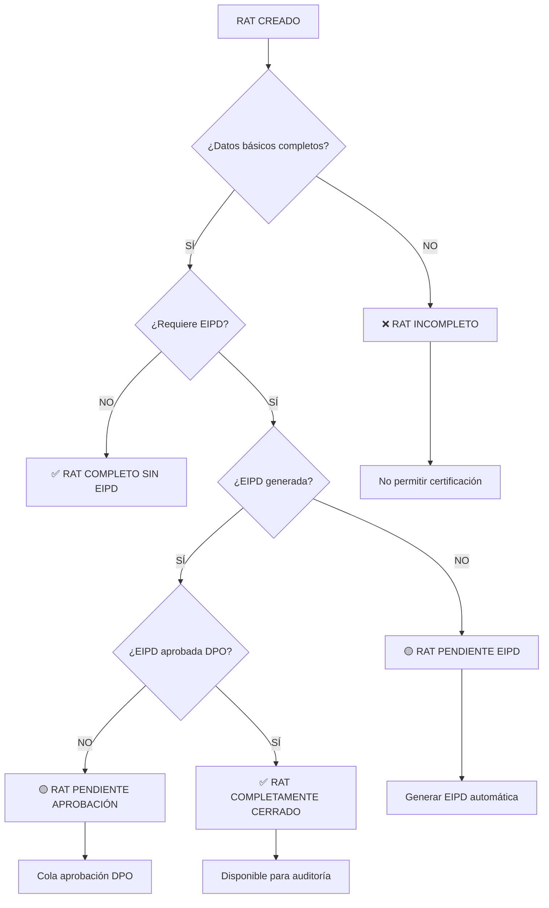

# 🔄 DIAGRAMA FLUJO COMPLETO - INTERRELACIONES SISTEMA LPDP

## 🎯 ESTADOS DE COMPLETITUD RAT



## 🔄 FLUJO MAESTRO: CICLO COMPLETO RAT-EIPD-DPO

```
┌─────────────────┐
│ 🆕 CREAR RAT    │
│ 6 pasos         │
└─────────┬───────┘
          │
          ▼
┌─────────────────┐     ✅     ┌──────────────────┐
│ ¿Validación OK? │ ────────── │ 💾 GUARDAR RAT   │ 
│ Datos completos │            │ mapeo_datos_rat  │
└─────────┬───────┘            └─────────┬────────┘
          │ ❌                           │
          ▼                             ▼
┌─────────────────┐              ┌──────────────────┐
│ ❌ ERROR        │              │ 🤖 IA EVALÚA     │
│ Mostrar fallos  │              │ Nivel riesgo     │
│ No guardar      │              │ Requiere EIPD?   │
└─────────────────┘              └─────────┬────────┘
                                          │
                                          ▼
                                 ┌──────────────────┐     NO
                                 │ ¿Riesgo ALTO?    │ ────────┐
                                 │ ¿Datos sensibles?│          │
                                 └─────────┬────────┘          │
                                          │ SÍ                │
                                          ▼                   ▼
                                 ┌──────────────────┐    ┌─────────────┐
                                 │ 🔄 AUTO-GENERAR │    │ 📋 REGISTRO │
                                 │ EIPD             │    │ INVENTARIO  │
                                 │ generated_docs   │    │ RAT         │
                                 └─────────┬────────┘    └─────────┬───┘
                                          │                       │
                                          ▼                       │
                                 ┌──────────────────┐              │
                                 │ 📋 CREAR TAREA   │              │
                                 │ DPO automática   │              │
                                 │ actividades_dpo  │              │
                                 └─────────┬────────┘              │
                                          │                       │
                                          ▼                       │
                                 ┌──────────────────┐              │
                                 │ 🔔 NOTIFICAR DPO │              │
                                 │ notifications    │              │
                                 └─────────┬────────┘              │
                                          │                       │
                                          ▼◄──────────────────────┘
                                 ┌──────────────────┐
                                 │ ✅ RAT EN COLA   │
                                 │ DPO Dashboard    │
                                 └─────────┬────────┘
                                          │
                                          ▼
                                 ┌──────────────────┐
                                 │ 👤 DPO REVISA    │
                                 │ Manual process   │
                                 └─────────┬────────┘
                                          │
                                          ▼
                                 ┌──────────────────┐     ❌
                                 │ ¿Aprueba DPO?    │ ────────┐
                                 └─────────┬────────┘          │
                                          │ ✅               │
                                          ▼                   ▼
                                 ┌──────────────────┐    ┌─────────────┐
                                 │ ✅ RAT APROBADO  │    │ 🔄 DEVOLVER │
                                 │ Estado: CERRADO  │    │ Correcciones│
                                 └─────────┬────────┘    └─────────────┘
                                          │
                                          ▼
                                 ┌──────────────────┐
                                 │ 🏁 PROCESO       │
                                 │ COMPLETADO       │
                                 │ ✅ Auditable     │
                                 └──────────────────┘
```

## 🔄 CRITERIOS CIERRE RAT

### ✅ RAT PUEDE CERRARSE CUANDO:
1. **Datos básicos completos** (Art.12 Ley 21.719)
2. **Si riesgo ALTO**: EIPD generada Y aprobada por DPO
3. **Si riesgo MEDIO/BAJO**: Solo revisión DPO (sin EIPD)
4. **Inventario actualizado** automáticamente
5. **Notificaciones enviadas** a DPO

### ❌ RAT NO PUEDE CERRARSE SI:
1. Faltan campos obligatorios
2. Riesgo ALTO sin EIPD aprobada
3. DPO no ha dado aprobación final
4. Errores en persistencia Supabase

## 🔄 CONSOLIDACIÓN DE RATs

```
┌─────────────────┐
│ MÚLTIPLES RATs  │
│ Mismo tenant    │
└─────────┬───────┘
          │
          ▼
┌─────────────────┐
│ 🔍 ANÁLISIS IA  │
│ Detectar        │
│ duplicados      │
│ similar scope   │
└─────────┬───────┘
          │
          ▼
┌─────────────────┐     SÍ     ┌──────────────────┐
│ ¿Consolidable?  │ ────────── │ 🔄 PROPONER      │
│ Mismo propósito │            │ Consolidación    │
│ Mismos datos    │            │ Auto-sugerencia  │
└─────────┬───────┘            └──────────────────┘
          │ NO
          ▼
┌─────────────────┐
│ ✅ MANTENER     │
│ RATs separados  │
│ Diferentes      │
│ finalidades     │
└─────────────────┘
```

## 🔄 API AUTOMÁTICAS E INTEGRACIÓN EXTERNA

### 📊 ENDPOINTS CONSOLIDADOS

```
┌─────────────────┐
│ 📡 API EXTERNA  │
│ GET /api/v1/    │
│ tenant/{id}/rats│
└─────────┬───────┘
          │
          ▼
┌─────────────────┐
│ 🛡️ VALIDACIÓN   │
│ API Key         │
│ Tenant válido   │
│ Permisos RLS    │
└─────────┬───────┘
          │
          ▼
┌─────────────────┐
│ 📋 CONSOLIDAR   │
│ Datos RATs      │
│ + EIPDs         │
│ + Estado DPO    │
└─────────┬───────┘
          │
          ▼
┌─────────────────┐
│ 📤 RESPUESTA    │
│ JSON unificado  │
│ {rats: [...],   │
│  eipds: [...],  │
│  compliance: %} │
└─────────────────┘
```

### 🔄 WEBHOOKS AUTOMÁTICOS

```
EVENTO: RAT_CREADO
┌─────────────────┐
│ Trigger automát.│ → Sistema externo recibe
│ POST webhook    │   {rat_id, tenant, risk}
└─────────────────┘

EVENTO: EIPD_GENERADA  
┌─────────────────┐
│ Trigger automát.│ → Sistema compliance
│ POST webhook    │   {eipd_id, rat_id, risk}
└─────────────────┘

EVENTO: RAT_APROBADO
┌─────────────────┐
│ Trigger automát.│ → Sistema auditoría
│ POST webhook    │   {rat_id, dpo_approval}
└─────────────────┘
```

## 🎯 PROTOCOLO INTEGRACIÓN SISTEMAS EXTERNOS

### 1. **SISTEMA ERP/CRM INTEGRATION**
```javascript
// Auto-sync con sistema ERP cliente
const syncWithERP = async (ratData) => {
  if (ratData.estado === 'APROBADO') {
    await webhook.send({
      url: tenant.erp_webhook_url,
      data: {
        compliance_status: 'APPROVED',
        rat_id: ratData.id,
        legal_basis: ratData.base_legal,
        data_categories: ratData.categorias_datos
      }
    });
  }
};
```

### 2. **SISTEMA AUDITORÍA EXTERNA**
```javascript
// Auto-registrar en sistema auditoría
const registerForAudit = async (ratData) => {
  if (ratData.nivel_riesgo === 'ALTO') {
    await auditSystem.register({
      entity_id: ratData.tenant_id,
      compliance_item: 'RAT_HIGH_RISK',
      due_date: calculateAuditDueDate(ratData),
      requirements: ['EIPD_APPROVED', 'DPO_SIGNED']
    });
  }
};
```

### 3. **SISTEMA LEGAL UPDATES**
```javascript
// Auto-actualizar ante cambios normativos
const handleLegalUpdate = async (newRegulation) => {
  const affectedRATs = await ratService.findByLegalBasis(
    newRegulation.affected_legal_basis
  );
  
  for (const rat of affectedRATs) {
    await ratService.flagForReview(rat.id, {
      reason: 'LEGAL_UPDATE',
      regulation: newRegulation.id,
      action_required: 'REVIEW_LEGAL_BASIS'
    });
  }
};
```

## 🔄 CONSOLIDACIÓN API ENDPOINTS

### 📊 ENDPOINT MAESTRO: `/api/v1/compliance/status`
```json
{
  "tenant_id": "tech_start_spa",
  "compliance_summary": {
    "total_rats": 15,
    "completed_rats": 12,
    "pending_eipds": 3,
    "compliance_percentage": 87.5,
    "last_update": "2025-09-02T12:00:00Z"
  },
  "rats": [
    {
      "id": 1,
      "nombre_actividad": "Gestión RRHH",
      "estado": "APROBADO",
      "nivel_riesgo": "MEDIO",
      "tiene_eipd": false,
      "dpo_approved": true,
      "is_complete": true
    }
  ],
  "pending_actions": [
    {
      "rat_id": 5,
      "action": "GENERATE_EIPD",
      "priority": "ALTA",
      "due_date": "2025-09-05"
    }
  ]
}
```

## 🎯 AUTOMATIZACIÓN COMPLETA

### 🤖 IA SUPERVISOR MASTER
```javascript
class MasterFlowSupervisor {
  async validateRATCompleteness(ratId) {
    const rat = await ratService.getRATById(ratId);
    const evaluation = await ratIntelligenceEngine.evaluateRAT(rat);
    
    const completeness = {
      basic_data: this.validateBasicData(rat),
      eipd_required: evaluation.riskLevel === 'ALTO',
      eipd_exists: await this.checkEIPDExists(ratId),
      dpo_approved: rat.estado === 'APROBADO',
      is_complete: false
    };
    
    // ✅ RAT COMPLETO = Datos básicos + (EIPD si requerida) + Aprobación DPO
    completeness.is_complete = 
      completeness.basic_data && 
      (!completeness.eipd_required || completeness.eipd_exists) &&
      completeness.dpo_approved;
    
    return completeness;
  }
  
  async autoConsolidateRATs(tenantId) {
    const rats = await ratService.getAllRATs(tenantId);
    const consolidationSuggestions = [];
    
    for (let i = 0; i < rats.length; i++) {
      for (let j = i + 1; j < rats.length; j++) {
        const similarity = await this.calculateSimilarity(rats[i], rats[j]);
        
        if (similarity > 0.8) {
          consolidationSuggestions.push({
            rat1: rats[i].id,
            rat2: rats[j].id,
            similarity: similarity,
            suggested_action: 'MERGE',
            benefits: ['Reducir duplicación', 'Simplificar gestión']
          });
        }
      }
    }
    
    return consolidationSuggestions;
  }
}
```

## 🔄 INTEGRACIÓN SISTEMAS EXTERNOS - APIs AUTOMÁTICAS

### 1. **WEBHOOK AUTO-REGISTRATION**
```javascript
// En cada tenant, auto-registrar webhooks
const registerTenantWebhooks = async (tenantId) => {
  const webhooks = [
    {
      event: 'RAT_CREATED',
      url: `${tenant.external_system_url}/compliance/rat-created`,
      method: 'POST',
      headers: { 'Authorization': `Bearer ${tenant.api_key}` }
    },
    {
      event: 'EIPD_APPROVED', 
      url: `${tenant.external_system_url}/compliance/eipd-approved`,
      method: 'POST'
    },
    {
      event: 'COMPLIANCE_ALERT',
      url: `${tenant.external_system_url}/alerts/compliance`,
      method: 'POST'
    }
  ];
  
  for (const webhook of webhooks) {
    await supabase.from('tenant_webhooks').insert({
      tenant_id: tenantId,
      ...webhook,
      created_at: new Date().toISOString()
    });
  }
};
```

### 2. **API CONSOLIDATION SERVICE**
```javascript
// Servicio consolidación automática
const apiConsolidationService = {
  
  // Endpoint maestro que consolida todo
  async getConsolidatedCompliance(tenantId) {
    const [rats, eipds, tasks, notifications] = await Promise.all([
      ratService.getAllRATs(tenantId),
      eipdService.getAllEIPDs(tenantId), 
      dpoService.getPendingTasks(tenantId),
      notificationService.getActive(tenantId)
    ]);
    
    const consolidatedData = {
      summary: {
        total_rats: rats.length,
        completed_rats: rats.filter(r => r.estado === 'APROBADO').length,
        pending_eipds: eipds.filter(e => e.status === 'BORRADOR').length,
        compliance_score: this.calculateComplianceScore(rats, eipds)
      },
      rats: rats.map(rat => ({
        ...rat,
        is_complete: this.isRATComplete(rat),
        related_eipd: eipds.find(e => e.source_rat_id === rat.id),
        pending_actions: tasks.filter(t => t.rat_id === rat.id)
      })),
      integration_ready: this.checkIntegrationReadiness(rats, eipds)
    };
    
    return consolidatedData;
  },
  
  // Auto-export para sistemas externos
  async autoExportToExternal(tenantId, format = 'json') {
    const consolidatedData = await this.getConsolidatedCompliance(tenantId);
    
    // Enviar a sistema externo automáticamente
    if (tenant.auto_export_enabled) {
      await this.sendToExternalSystem(consolidatedData, tenant.export_config);
    }
    
    return consolidatedData;
  }
};
```

## 🎯 INDICADORES AUTOMATIZACIÓN COMPLETA

### ✅ CUANDO CONSIDERAR RAT "CERRADO":
1. **Estado técnico**: `estado = 'APROBADO'`
2. **Validación IA**: `is_complete = true`
3. **EIPD requerida**: Si riesgo ALTO, debe existir EIPD aprobada
4. **DPO approval**: Firma digital DPO en actividades_dpo
5. **Auditoría**: Registrado en audit_log como 'COMPLETED'

### 🔄 PROCESO AUTO-CONSOLIDACIÓN:
1. **Detección automática** de RATs similares (IA analiza contenido)
2. **Sugerencia consolidación** en dashboard DPO
3. **Aprobación manual** DPO para merger
4. **Ejecución automática** merge + actualización referencias

### 📡 APIS COMPLETAMENTE AUTOMÁTICAS:
1. **Webhook triggers** en cada cambio estado
2. **Export automático** datos compliance
3. **Sync bidireccional** con ERP/CRM cliente
4. **Alertas proactivas** ante vencimientos
5. **Reportes automáticos** mensuales/anuales

## 🛡️ PROTOCOLO INTEGRIDAD SISTÉMICA

```javascript
// Validación integridad completa antes de "cerrar" RAT
const validateSystemIntegrity = async (ratId) => {
  const checks = {
    rat_exists: await checkRATExists(ratId),
    data_complete: await validateAllFields(ratId),
    eipd_if_required: await validateEIPDRequirement(ratId),
    dpo_approval: await checkDPOApproval(ratId),
    inventory_updated: await checkInventorySync(ratId),
    notifications_sent: await checkNotificationsSent(ratId),
    audit_trail: await checkAuditTrail(ratId)
  };
  
  const allValid = Object.values(checks).every(check => check === true);
  
  if (allValid) {
    // Auto-marcar como CERRADO
    await ratService.markAsClosed(ratId);
    await this.triggerCompletionWebhooks(ratId);
  }
  
  return { canClose: allValid, failedChecks: checks };
};
```

---

**🎯 RESUMEN EJECUTIVO:**
1. **RAT solo se cierra** cuando cumple TODOS los requisitos
2. **Consolidación automática** por IA + aprobación DPO
3. **APIs automáticas** para integración externa 
4. **Webhooks en tiempo real** para eventos críticos
5. **Validación sistémica** antes de marcar "completo"

**🚀 PRÓXIMOS PASOS AUTOMATIZACIÓN:**
- Implementar webhook auto-registration por tenant
- Crear endpoint maestro `/api/v1/compliance/consolidated`  
- Activar auto-export programado
- Configurar alertas proactivas vencimientos
- Establecer sync bidireccional ERP/CRM