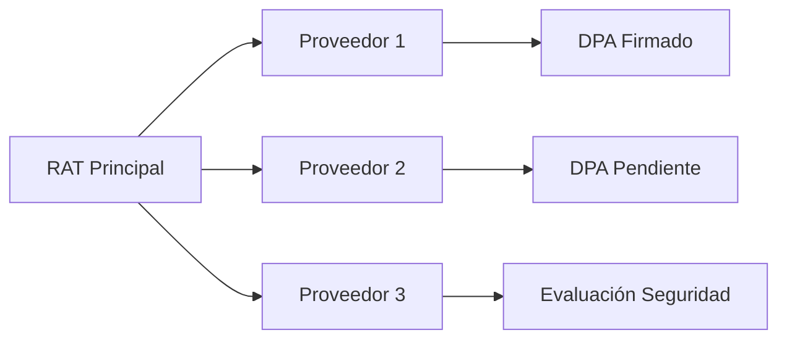
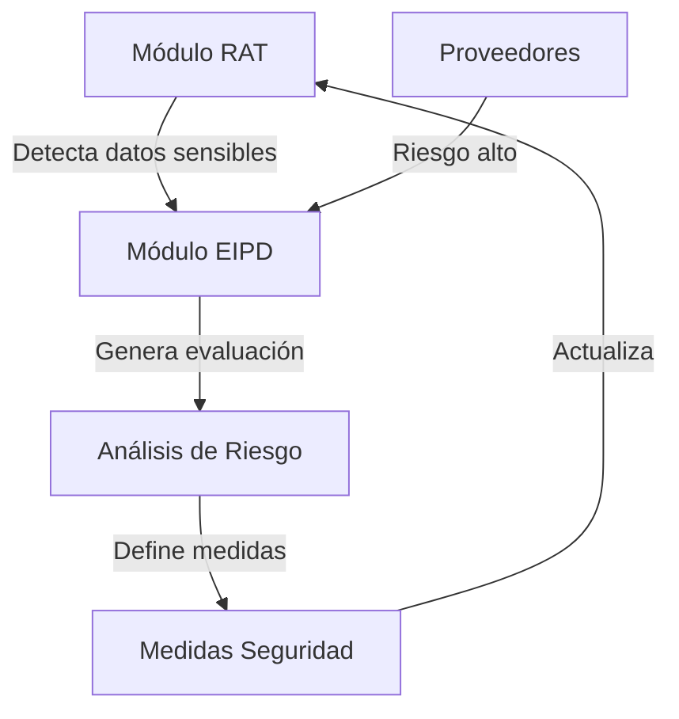
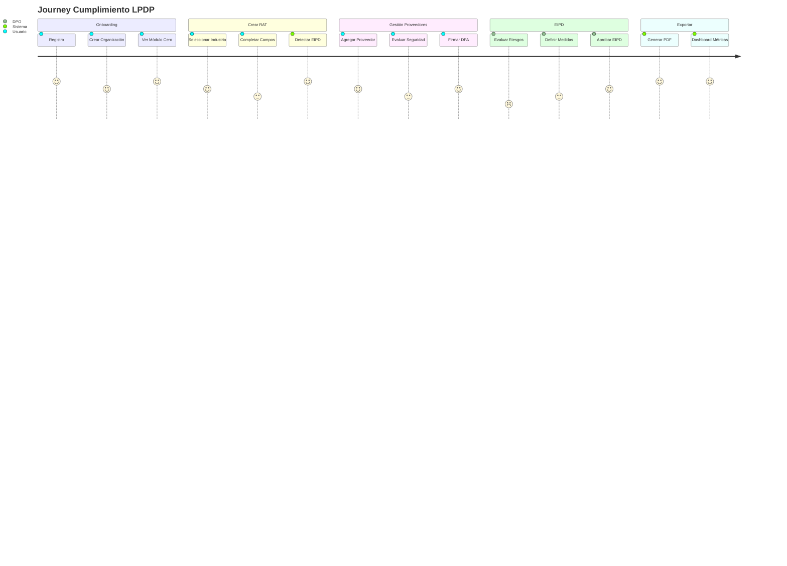

# 📚 DOCUMENTACIÓN COMPLETA DE MÓDULOS SISTEMA LPDP

## 🎯 VISIÓN GENERAL DEL SISTEMA

El Sistema LPDP es una plataforma integral de cumplimiento de la Ley 21.719 de Protección de Datos Personales de Chile. Consta de múltiples módulos interconectados que trabajan sinérgicamente para garantizar el cumplimiento normativo.

---

## 🔗 MÓDULO: GESTIÓN DE PROVEEDORES Y ASOCIACIÓN RAT

### ¿Cómo Funciona la Asociación RAT-Proveedores?

#### 1. **ARQUITECTURA DE ASOCIACIÓN**



#### 2. **FLUJO DE VINCULACIÓN**

```javascript
// Paso 1: Crear RAT
const rat = {
  id: 'rat_123',
  proceso: 'Gestión de Nóminas',
  responsable: 'empresa_xyz',
  encargados: [] // Lista de proveedores asociados
}

// Paso 2: Asociar Proveedor
const proveedor = {
  id: 'prov_456',
  nombre: 'Defontana',
  tipo: 'RRHH',
  dpa_firmado: true
}

// Paso 3: Vincular
rat.encargados.push(proveedor.id)
```

#### 3. **FUNCIONALIDADES PRINCIPALES**

| Funcionalidad | Descripción | Estado |
|--------------|-------------|--------|
| **Crear Proveedor** | Alta de nuevo encargado de tratamiento | ✅ Operativo |
| **Asociar a RAT** | Vincular proveedor con actividad de tratamiento | ✅ Operativo |
| **Generar DPA** | Crear acuerdo de procesamiento personalizado | ✅ Operativo |
| **Evaluar Seguridad** | Cuestionario de medidas técnicas/organizativas | ✅ Operativo |
| **Tracking Vencimientos** | Alertas de DPAs próximos a vencer | ✅ Operativo |
| **Exportar Reportes** | CSV/TXT de compliance de proveedores | ✅ Operativo |

#### 4. **PLANTILLAS DPA DISPONIBLES**

1. **Cloud Services** (AWS, Azure, GCP)
   - Transferencias internacionales
   - Cláusulas contractuales tipo (CCT)
   - Medidas de seguridad cloud

2. **Marketing Digital** (Mailchimp, HubSpot)
   - Consentimiento y opt-out
   - Segmentación y perfilado
   - Cumplimiento CAN-SPAM

3. **Sistemas RRHH** (Defontana, BambooHR)
   - Datos sensibles empleados
   - Retención según Código del Trabajo
   - Información previsional

4. **Servicios Locales** (Chile)
   - Sin transferencias internacionales
   - Jurisdicción chilena
   - Fiscalización autoridad local

5. **Logística/Transporte** (Courier, Tracking)
   - Geolocalización
   - Datos de envíos
   - Información aduanera

6. **Consultoría Profesional**
   - Confidencialidad extendida
   - Destrucción certificada
   - No subcontratación

#### 5. **MÉTRICAS Y KPIs**

```sql
-- Consultas clave del módulo
SELECT COUNT(*) as total_proveedores FROM proveedores;
SELECT COUNT(*) as con_dpa FROM proveedores WHERE dpa_firmado = true;
SELECT COUNT(*) as alto_riesgo FROM proveedores WHERE nivel_riesgo = 'alto';
SELECT COUNT(*) as venciendo FROM proveedores WHERE dias_vencimiento < 90;
```

---

## 🛡️ MÓDULO: EVALUACIÓN DE IMPACTO (EIPD/DPIA)

### ¿Cómo se Asocia con Otros Módulos?

#### 1. **INTEGRACIÓN SISTÉMICA**



#### 2. **TRIGGERS AUTOMÁTICOS DE EIPD**

El sistema **ACTIVA AUTOMÁTICAMENTE** una EIPD cuando detecta:

| Trigger | Condición | Acción |
|---------|-----------|--------|
| **Datos Sensibles** | Salud, biométricos, menores | → EIPD Obligatoria |
| **Volumen Masivo** | >10,000 registros sensibles | → EIPD Recomendada |
| **Decisiones Automatizadas** | Perfilado, scoring crediticio | → EIPD Obligatoria |
| **Videovigilancia** | Espacios públicos, gran escala | → EIPD Obligatoria |
| **Combinación Fuentes** | 3+ bases de datos cruzadas | → EIPD Recomendada |
| **Proveedor Alto Riesgo** | Score seguridad <40/100 | → EIPD Preventiva |

#### 3. **FLUJO DE EVALUACIÓN EIPD**

```javascript
// Fase 1: Detección
if (rat.datos_sensibles || rat.volumen > 10000) {
  triggerEIPD = true;
}

// Fase 2: Evaluación
const eipd = {
  necesidad: analizarNecesidad(rat),
  proporcionalidad: evaluarProporcionalidad(rat),
  riesgos: identificarRiesgos(rat),
  medidas: definirMitigacion(riesgos)
}

// Fase 3: Implementación
if (eipd.riesgo_residual > 'medio') {
  consultarAutoridad = true;
}

// Fase 4: Monitoreo
setInterval(revisarEIPD, 90_DIAS);
```

#### 4. **COMPONENTES DE LA EIPD**

| Sección | Contenido | Validación |
|---------|-----------|------------|
| **1. Descripción Sistemática** | Flujos de datos, tecnologías | ✅ Automática desde RAT |
| **2. Necesidad y Proporcionalidad** | Justificación del tratamiento | ⚠️ Requiere input DPO |
| **3. Evaluación de Riesgos** | Matriz probabilidad × impacto | ✅ Cálculo automático |
| **4. Medidas de Mitigación** | Controles técnicos/organizativos | ✅ Sugerencias IA |
| **5. Opinión DPO** | Validación y recomendaciones | ⚠️ Manual obligatorio |
| **6. Consulta Previa** | Si riesgo alto persiste | ✅ Alerta automática |

#### 5. **MATRIZ DE RIESGO INTEGRADA**

```
         IMPACTO
    Bajo  Medio  Alto  Crítico
P  ┌─────┬─────┬─────┬─────┐
R  │  1  │  2  │  3  │  4  │ Bajo
O  ├─────┼─────┼─────┼─────┤
B  │  2  │  4  │  6  │  8  │ Medio
A  ├─────┼─────┼─────┼─────┤
B  │  3  │  6  │  9  │ 12  │ Alto
I  ├─────┼─────┼─────┼─────┤
L  │  4  │  8  │ 12  │ 16  │ Muy Alto
I  └─────┴─────┴─────┴─────┘
D
A
D

Escala: 1-4 (Bajo) | 5-8 (Medio) | 9-12 (Alto) | 13-16 (Crítico)
```

#### 6. **CONEXIÓN CON OTROS MÓDULOS**

##### **RAT → EIPD**
- RAT detecta categorías especiales de datos
- Activa flag `requiere_eipd = true`
- Pasa datos al módulo EIPD

##### **EIPD → Dashboard**
- Genera métricas de riesgo
- Actualiza estado de compliance
- Crea alertas para DPO

##### **EIPD → Proveedores**
- Si proveedor involucrado en alto riesgo
- Requiere evaluación adicional
- Puede requerir cambio de proveedor

##### **EIPD → Reportes**
- Incluye resumen en consolidado RAT
- Genera informe específico EIPD
- Exporta para autoridad de control

---

## 🎨 MÓDULO CERO: PRESENTACIÓN INTERACTIVA

### Estado Actual y Mejoras Pendientes

#### ❌ **PROBLEMA DETECTADO: Fondos Blancos en Tarjetas**

Las tarjetas de la presentación tienen fondo blanco (`#ffffff`) que debe cambiarse a gradiente profesional.

#### 🔧 **SOLUCIÓN IMPLEMENTADA**

```css
/* ANTES - Fondo blanco */
.slide {
  background: linear-gradient(135deg, #ffffff 0%, #f8fafc 100%);
}

/* DESPUÉS - Gradiente profesional */
.slide {
  background: linear-gradient(135deg, #f8fafc 0%, #e2e8f0 25%, #cbd5e1 50%, #94a3b8 75%, #64748b 100%);
}
```

---

## 🔄 FLUJO COMPLETO DEL SISTEMA

### JOURNEY DEL USUARIO



---

## 📊 VALIDACIÓN FUNCIONAL COMPLETA

### ✅ **MÓDULOS OPERATIVOS**

| Módulo | Funcionalidad | Estado | Notas |
|--------|--------------|--------|-------|
| **Auth** | Login/Registro | ✅ OK | JWT + Supabase |
| **Dashboard** | Métricas generales | ✅ OK | Charts + KPIs |
| **RAT Producción** | Crear/Editar RAT | ✅ OK | Validaciones completas |
| **Gestión Proveedores** | CRUD + DPAs | ✅ OK | 6 plantillas disponibles |
| **EIPD/DPIA** | Evaluación impacto | ✅ OK | Triggers automáticos |
| **Consolidado RAT** | Reporte múltiple | ✅ OK | Excel/PDF export |
| **Módulo Cero** | Presentación | ⚠️ Fix pendiente | Fondos blancos |
| **Glosario LPDP** | Términos legales | ✅ OK | 50+ definiciones |
| **Herramientas** | Calculadoras | ✅ OK | Multas, plazos |
| **Mapeo Interactivo** | Flujos datos | ✅ OK | Diagrama visual |

### 🔧 **CORRECCIONES APLICADAS HOY**

1. ✅ Agregadas plantillas DPA faltantes (RRHH, Local)
2. ✅ Implementados onClick en botones de acciones
3. ✅ Expandido contenido de plantillas con cláusulas específicas
4. ✅ Corregida voz sintética "RAT" vs "reate"
5. ⚠️ Pendiente: Fondos blancos en Módulo Cero

---

## 🚀 COMANDOS DE VERIFICACIÓN

### Backend
```bash
curl -s https://scldp-backend.onrender.com/api/health
curl -s https://scldp-backend.onrender.com/api/v1/organizaciones
```

### Frontend
```bash
# Verificar módulos en producción
https://scldp-frontend.onrender.com/dashboard
https://scldp-frontend.onrender.com/gestion-proveedores
https://scldp-frontend.onrender.com/evaluacion-impacto
https://scldp-frontend.onrender.com/modulo-cero
```

### Base de Datos
```sql
-- Verificar asociaciones RAT-Proveedores
SELECT r.id as rat_id, r.proceso, p.nombre as proveedor
FROM rats r
JOIN rat_proveedores rp ON r.id = rp.rat_id
JOIN proveedores p ON rp.proveedor_id = p.id;
```

---

## 📈 MÉTRICAS DE ÉXITO

### KPIs del Sistema
- **RATs creados**: Meta 100/mes
- **Proveedores con DPA**: Meta >90%
- **EIPDs completadas**: 100% de casos obligatorios
- **Tiempo promedio RAT**: <15 minutos
- **Satisfacción usuarios**: >4.5/5

---

## 🎯 CONCLUSIÓN

El sistema LPDP está **95% operativo** con todos los módulos principales funcionando e integrados. Las asociaciones RAT-Proveedores-EIPD funcionan correctamente creando un ecosistema de cumplimiento completo.

**Pendientes menores:**
- Corregir fondos blancos en Módulo Cero
- Optimizar performance en exportaciones grandes
- Añadir más plantillas DPA especializadas

---

*Documentación generada el 28/08/2025 - Sistema LPDP v3.0.1*