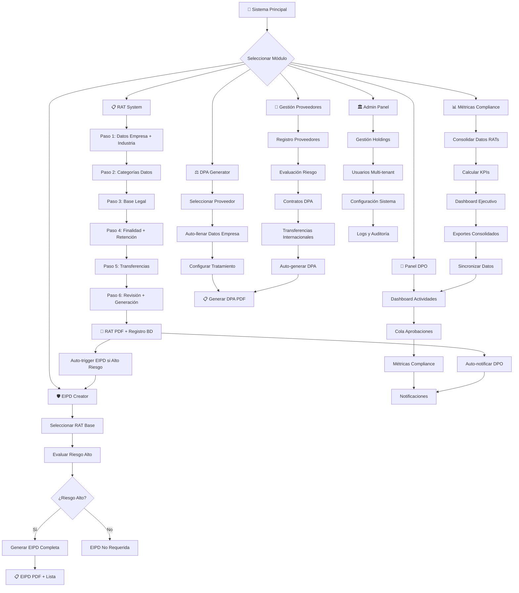

# 📋 SISTEMA DE CUMPLIMIENTO LPDP - LEY 21.719
## Documentación Técnica y Funcional Completa

---

## 🎯 RESUMEN EJECUTIVO

**Sistema integral de cumplimiento para la Ley 21.719 de Protección de Datos Personales de Chile, desarrollado para estudios jurídicos y empresas que requieren gestión profesional del compliance LPDP.**

### Características Principales:
- ✅ **Registro de Actividades de Tratamiento (RAT)** - Art. 15 Ley 21.719
- ✅ **Evaluaciones de Impacto (EIPD/DPIA)** - Art. 25 Ley 21.719  
- ✅ **Panel DPO Profesional** - Art. 47 Ley 21.719
- ✅ **Generador DPA Automático** - Art. 24 Ley 21.719
- ✅ **Gestión Proveedores/Encargados** - Art. 24-26 Ley 21.719
- ✅ **Sistema Multi-tenant** - Holdings y subsidiarias
- ✅ **Métricas Compliance** - Dashboard ejecutivo
- ✅ **Exportes PDF/Excel** - Reportes consolidados

---

## 🏗️ ARQUITECTURA DEL SISTEMA

```
┌─────────────────┐    ┌─────────────────┐    ┌─────────────────┐
│   FRONTEND      │    │    BACKEND      │    │   DATABASE      │
│   React + MUI   │◄──►│    Supabase     │◄──►│  PostgreSQL     │
│                 │    │   + RLS + Auth  │    │   + Views       │
└─────────────────┘    └─────────────────┘    └─────────────────┘
```

### Stack Tecnológico:
- **Frontend:** React 18 + Material-UI + React Router
- **Backend:** Supabase (PostgreSQL + Auth + RLS)
- **Estado:** React Context + Local State
- **Estilo:** Material-UI Dark Theme + Custom CSS
- **Seguridad:** Row Level Security (RLS) + Multi-tenant

---

## 📊 DIAGRAMA DE FLUJO DE PROCESOS ADMINISTRATIVOS



---

## 🔧 MÓDULOS DEL SISTEMA

### 1. 📋 **SISTEMA RAT (Registro Actividades Tratamiento)**
**Ruta:** `/rat-system`  
**Fundamento Legal:** Art. 15 Ley 21.719

#### Funcionalidades:
- ✅ **Creación RAT paso a paso (6 pasos)**
- ✅ **Auto-completado datos empresa/DPO**
- ✅ **Selección industria con regulaciones específicas**
- ✅ **Categorización datos personales vs sensibles**
- ✅ **Base legal con argumentos jurídicos**
- ✅ **Finalidades y plazos conservación**
- ✅ **Destinatarios internos**
- ✅ **Transferencias internacionales**
- ✅ **Generación PDF profesional**

#### Flujo de Datos:
```
Usuario → Formulario 6 Pasos → Validación → BD (mapeo_datos_rat) → PDF Export
```

#### Validaciones:
- ✅ RUT válido con DV
- ✅ Datos empresa obligatorios
- ✅ Finalidad mínimo 20 caracteres
- ✅ Selección base legal obligatoria
- ✅ Auto-trigger EIPD si datos sensibles

---

### 2. 🛡️ **EIPD CREATOR (Evaluación Impacto)**
**Ruta:** `/eipd-creator`  
**Fundamento Legal:** Art. 25 Ley 21.719

#### Funcionalidades:
- ✅ **Evaluación automática riesgo alto**
- ✅ **Generación EIPD basada en RAT**
- ✅ **Medidas mitigación automáticas**
- ✅ **Consulta previa automática si requiere**
- ✅ **Lista EIPDs guardadas**
- ✅ **Export PDF con fundamentos legales**

#### Triggers Automáticos:
- 🔄 **Datos sensibles detectados en RAT**
- 🔄 **Transferencias internacionales**
- 🔄 **Tratamiento automatizado/perfilado**
- 🔄 **Gran escala (>1000 registros)**

#### Flujo de Datos:
```
RAT → Análisis Riesgo → EIPD Generator → BD (evaluaciones_impacto) → Lista EIPDs
```

---

### 3. 👤 **PANEL DPO (Delegado Protección Datos)**
**Ruta:** `/dashboard-dpo`  
**Fundamento Legal:** Art. 47 Ley 21.719

#### Funcionalidades:
- ✅ **Dashboard actividades pendientes**
- ✅ **Cola aprobaciones RATs**
- ✅ **Notificaciones automáticas**
- ✅ **Métricas compliance tiempo real**
- ✅ **Gestión solicitudes derechos ARCO**
- ✅ **Alertas vencimientos**

#### KPIs Monitoreados:
- 📊 RATs certificados vs pendientes
- 📊 EIPDs completadas vs requeridas  
- 📊 Compliance score general
- 📊 Proveedores auditados
- 📊 Transferencias sin DPA

#### Flujo de Datos:
```
Múltiples Módulos → DataSync Service → Dashboard DPO → Acciones Correctivas
```

---

### 4. 🤝 **GESTIÓN PROVEEDORES**
**Ruta:** `/provider-manager`  
**Fundamento Legal:** Art. 24-26 Ley 21.719

#### Funcionalidades:
- ✅ **Registro proveedores/encargados**
- ✅ **Evaluación riesgo automática**
- ✅ **Contratos DPA integrados**
- ✅ **Seguimiento transferencias**
- ✅ **Auditorías compliance**
- ✅ **Matriz riesgos por país**

#### Estados Proveedor:
- 🔴 **PENDIENTE** - Sin evaluar
- 🟡 **EN_REVISION** - Bajo análisis  
- 🟢 **APROBADO** - Con DPA firmado
- ⚫ **SUSPENDIDO** - Incumplimientos

#### Flujo de Datos:
```
Registro Proveedor → Evaluación Riesgo → DPA Generator → Monitoring → Renovación
```

---

### 5. ⚖️ **DPA GENERATOR (Data Processing Agreement)**
**Ruta:** `/dpa-generator`  
**Fundamento Legal:** Art. 24 Ley 21.719

#### Funcionalidades:
- ✅ **Auto-completado datos empresa**
- ✅ **Selección proveedor registrado**
- ✅ **Configuración tratamiento específico**
- ✅ **Cláusulas automáticas por país**
- ✅ **Generación contrato PDF**
- ✅ **Integración con proveedores**

#### Tipos DPA Soportados:
- 🌐 **Cloud Services** (AWS, Azure, Google)
- 💳 **Payment Processors** (Stripe, PayPal)
- 📧 **Marketing Platforms** (MailChimp, HubSpot)
- 🔒 **Security Services** (Antivirus, Firewalls)

#### Flujo de Datos:
```
Proveedor → Template DPA → Datos Empresa → Configuración → PDF Contrato
```

---

### 6. 📊 **MÉTRICAS COMPLIANCE**
**Ruta:** `/compliance-metrics`  
**Fundamento Legal:** Art. 47 Ley 21.719

#### Funcionalidades:
- ✅ **Dashboard ejecutivo**
- ✅ **KPIs tiempo real**
- ✅ **Gráficos tendencias**
- ✅ **Alertas proactivas**
- ✅ **Comparativa sectorial**
- ✅ **Reportes consolidados**

#### Métricas Clave:
- 📈 **Compliance Score** (0-100%)
- 📈 **RATs Completitud** 
- 📈 **EIPDs Coverage**
- 📈 **DPAs Vigentes**
- 📈 **Tiempo Respuesta ARCO**

#### Flujo de Datos:
```
Todos los Módulos → DataSync → Cálculos KPI → Dashboard → Alertas → Exportes
```

---

### 7. 🏛️ **ADMIN PANEL (Multi-tenant)**
**Ruta:** `/admin-dashboard`  
**Fundamento Legal:** Gestión organizacional

#### Funcionalidades:
- ✅ **Gestión holdings y subsidiarias**
- ✅ **Usuarios multi-tenant**
- ✅ **Roles y permisos**
- ✅ **Configuración sistema**
- ✅ **Logs de auditoría**
- ✅ **Respaldos automáticos**

#### Roles Sistema:
- 👑 **SUPER_ADMIN** - Control total
- 🛡️ **ADMIN** - Gestión holding
- ⚖️ **DPO** - Supervisión compliance
- 👤 **USER** - Operación RATs

#### Flujo de Datos:
```
Admin → Gestión Tenants → Configuración → Usuarios → Permisos → Auditoría
```

---

### 8. 📚 **GLOSARIO LPDP**
**Ruta:** `/glosario`  
**Fundamento Legal:** Ley 21.719 completa

#### Funcionalidades:
- ✅ **+200 términos legales**
- ✅ **Búsqueda inteligente**
- ✅ **Categorización temática**
- ✅ **Referencias artículos ley**
- ✅ **Ejemplos prácticos**
- ✅ **Actualizaciones normativas**

---

## 🔄 FLUJO DE DATOS ENTRE MÓDULOS

```
┌─────────────┐    ┌─────────────┐    ┌─────────────┐
│ RAT System  │───►│ EIPD Creator│───►│ DPO Panel   │
│             │    │             │    │             │
│ • Crea RAT  │    │ • Auto EIPD │    │ • Supervisión│
│ • Valida    │    │ • Riesgo    │    │ • Aprobación │
└─────────────┘    └─────────────┘    └─────────────┘
       │                   │                   │
       ▼                   ▼                   ▼
┌─────────────┐    ┌─────────────┐    ┌─────────────┐
│Proveedores  │    │DPA Generator│    │ Métricas    │
│             │◄───│             │───►│             │
│ • Registro  │    │ • Contratos │    │ • Dashboard │
│ • Auditoría │    │ • PDF       │    │ • KPIs      │
└─────────────┘    └─────────────┘    └─────────────┘
       │                   │                   │
       ▼                   ▼                   ▼
       └─────────────┬─────────────┬─────────────┘
                     ▼
            ┌─────────────┐
            │Admin Panel  │
            │             │
            │ • Holdings  │
            │ • Usuarios  │
            │ • Config    │
            └─────────────┘
```

---

## 🔐 SEGURIDAD Y COMPLIANCE

### Row Level Security (RLS):
- ✅ **Aislamiento multi-tenant**
- ✅ **Acceso por roles**
- ✅ **Auditoría completa**
- ✅ **Encriptación en tránsito y reposo**

### Cumplimiento Normativo:
- ✅ **Art. 15** - RAT obligatorio
- ✅ **Art. 25** - EIPD automática
- ✅ **Art. 24** - DPA proveedores
- ✅ **Art. 47** - Supervisión DPO
- ✅ **Art. 31** - Derechos ARCO

---

## 📈 MÉTRICAS Y KPIS

### KPIs Principales:
1. **Compliance Score** - % cumplimiento general
2. **RATs Completitud** - Campos obligatorios llenos
3. **EIPD Coverage** - % actividades alto riesgo evaluadas
4. **DPA Vigencia** - % proveedores con contratos actualizados
5. **Tiempo Respuesta** - Promedio atención solicitudes ARCO

### Alertas Automáticas:
- 🔔 **RAT vencido** (1 año)
- 🔔 **EIPD requerida** (datos sensibles)
- 🔔 **DPA próximo vencer** (30 días)
- 🔔 **Proveedor sin evaluar** (7 días)
- 🔔 **Solicitud ARCO pendiente** (15 días)

---

## 🚀 ROADMAP Y MEJORAS CONTINUAS

### Fase Actual (v3.0):
- ✅ Sistema RAT completo
- ✅ EIPD automático
- ✅ Panel DPO funcional
- ✅ Multi-tenant operativo

### Próximas Mejoras (v3.1):
- 🔄 API integraciones externas
- 🔄 BI avanzado con charts
- 🔄 Mobile responsive
- 🔄 Notificaciones push

### Futuro (v4.0):
- 🔮 IA para evaluación automática riesgos
- 🔮 Blockchain para inmutabilidad
- 🔮 Integración SERNAC/CMF
- 🔮 Compliance otras jurisdicciones (GDPR, CCPA)

---

## 📞 SOPORTE Y MANTENIMIENTO

### Contacto Técnico:
- **Desarrollador:** Claude Code
- **Empresa:** Jurídica Digital SpA
- **Email:** desarrollo@juridicadigital.cl
- **Documentación:** Este archivo + comentarios código

### Mantenimiento:
- 🔄 **Actualizaciones normativas** automáticas
- 🔄 **Respaldos diarios** Supabase
- 🔄 **Monitoreo 24/7** uptime
- 🔄 **Soporte técnico** horario hábil

---

**📅 Documento actualizado:** Enero 2025  
**🔧 Versión Sistema:** v3.0  
**⚖️ Base Legal:** Ley 21.719 vigente