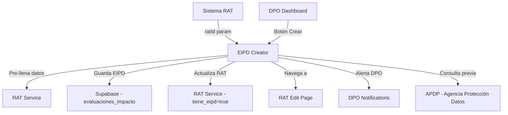

# 🔐 DIAGRAMA DE FLUJO - MÓDULO EIPD CREATOR
## Evaluación de Impacto en Protección de Datos (EIPD/DPIA)

### 📋 PROPÓSITO
Crear evaluaciones de impacto obligatorias según Art. 25 Ley 21.719 para actividades de alto riesgo en tratamiento de datos personales.

### 🔗 CONEXIONES CON OTROS MÓDULOS



### 🚀 FLUJO PRINCIPAL DEL PROCESO

```
INICIO
  ↓
[¿Viene desde RAT?] 
  ↓ SÍ → [Cargar datos RAT] → [Pre-llenar formularios]
  ↓ NO → [Formulario vacío]
  ↓
[PASO 1: Información General]
  • Nombre evaluación
  • Evaluador responsable  
  • Descripción actividad
  • Relación con RAT
  ↓
[PASO 2: Criterios de Necesidad - Art. 25]
  • ✅ Datos sensibles a gran escala
  • ✅ Decisiones automatizadas
  • ✅ Observación sistemática
  • ✅ Nuevas tecnologías (IA, IoT, biometría)
  • ✅ Datos de menores masivo
  • ✅ Combinación múltiples fuentes
  ↓
[EVALUACIÓN AUTOMÁTICA] → ¿Requiere EIPD obligatoria?
  ↓ SÍ → [⚠️ ALERTA: EIPD OBLIGATORIA]
  ↓
[PASO 3: Descripción Sistemática]
  • Finalidades específicas
  • Categorías datos personales
  • Categorías titulares
  • Destinatarios datos
  • Plazos supresión
  ↓
[PASO 4: Necesidad y Proporcionalidad]
  • Evaluación necesidad
  • Evaluación proporcionalidad
  • Alternativas menos invasivas
  • Justificación final
  ↓
[PASO 5: Evaluación de Riesgos]
  • Matriz de riesgos (7 factores):
    - Acceso no autorizado
    - Uso indebido datos sensibles
    - Pérdida de datos
    - Discriminación automatizada
    - Violación privacidad
    - Daño reputacional
    - Impacto económico titular
  • Probabilidad: BAJA|MEDIA|ALTA
  • Impacto: BAJO|MEDIO|ALTO
  • ↓
  [CÁLCULO AUTOMÁTICO RIESGO FINAL]
    ALTO: Prob=ALTA + Impacto=ALTO/MEDIO ó Prob=MEDIA + Impacto=ALTO
    MEDIO: Prob=MEDIA + Impacto=MEDIO ó otros cruces
    BAJO: Resto combinaciones
  ↓
[PASO 6: Medidas de Mitigación]
  • Medidas Técnicas (8 opciones):
    - Cifrado datos en reposo/tránsito
    - Control acceso basado roles
    - Autenticación multifactor
    - Monitoreo accesos
    - Backup cifrado
    - Anonimización/Pseudonimización
    - Minimización datos
  • Medidas Organizativas (8 opciones):
    - Políticas privacidad
    - Capacitación personal
    - Designación DPO
    - Procedimientos respuesta incidentes
    - Auditorías regulares
    - Contratos DPA proveedores
    - Evaluaciones riesgo periódicas
    - Registro actividades
  • Riesgo residual descripción
  ↓
[PASO 7: Conclusiones y Aprobación]
  • Evaluación final
  • Recomendaciones implementación
  • ↓
  [EVALUACIÓN FINAL AUTOMÁTICA]
    ¿EIPD Obligatoria? + ¿Riesgo=ALTO?
    ↓ SÍ → [🚨 CONSULTA PREVIA APDP REQUERIDA]
    ↓ NO → [✅ Puede proceder]
  ↓
[GUARDAR EIPD COMPLETA]
  • Insertar en tabla evaluaciones_impacto
  • Calcular nivel_riesgo_final
  • Marcar requiere_consulta_previa
  • Estado = 'COMPLETADA'
  • ↓
  [¿Viene desde RAT?]
    ↓ SÍ → [Actualizar RAT: tiene_eipd=true, eipd_id]
    ↓
[NAVEGACIÓN FINAL]
  • Si desde RAT → /rat-edit/{ratId}
  • Si independiente → /compliance-metrics
  ↓
FIN
```

### 🔄 INTEGRACIONES Y SINCRONIZACIÓN

#### **ENTRADA DE DATOS**
- **Desde RAT:** Pre-llena automáticamente campos desde RAT existente
- **Independiente:** Formulario vacío para nueva evaluación

#### **GUARDADO EN BASE DE DATOS**
```sql
-- Tabla: evaluaciones_impacto
{
  id: string,
  tenant_id: integer,
  rat_id: string (opcional),
  nombre_evaluacion: string,
  contenido_eipd: jsonb, -- Todo el objeto eipdData
  nivel_riesgo: 'ALTO'|'MEDIO'|'BAJO',
  requiere_consulta_previa: boolean,
  estado: 'COMPLETADA',
  created_at: timestamp
}
```

#### **ACTUALIZACIÓN RAT**
```sql
-- Si viene desde RAT, actualiza:
UPDATE mapeo_datos_rat SET 
  tiene_eipd = true,
  eipd_id = {nuevo_eipd_id},
  updated_at = NOW()
WHERE id = {ratId}
```

### ⚖️ CUMPLIMIENTO LEGAL

#### **Art. 25 Ley 21.719 - Criterios Obligatorios EIPD:**
1. Tratamiento datos sensibles a gran escala
2. Decisiones automatizadas con efectos legales
3. Observación sistemática espacios públicos
4. Uso nuevas tecnologías (IA, IoT, biometría)
5. Tratamiento masivo datos menores
6. Combinación múltiples fuentes datos

#### **Consulta Previa APDP:**
- **Cuándo:** EIPD Obligatoria + Riesgo ALTO
- **Efecto:** Suspende inicio tratamiento hasta aprobación APDP

### 🎯 PUNTOS CRÍTICOS DE INTEGRACIÓN

1. **RAT → EIPD:** Transferencia automática de datos
2. **EIPD → RAT:** Actualización bidireccional estado
3. **EIPD → DPO Dashboard:** Notificaciones y alertas
4. **EIPD → Compliance Metrics:** Estadísticas cumplimiento
5. **EIPD → Audit Trail:** Registro completo cambios

### 🚨 ALERTAS Y NOTIFICACIONES

- **EIPD Obligatoria:** Alerta roja automática
- **Consulta Previa:** Notificación crítica a DPO
- **Riesgo Alto:** Warning en dashboard
- **EIPD Completada:** Confirmación al usuario

### 📊 MÉTRICAS GENERADAS

- Total EIPDs creadas por tenant
- % EIPDs que requieren consulta previa
- Distribución niveles de riesgo
- Tiempo promedio completar EIPD
- RATs con EIPD vs sin EIPD