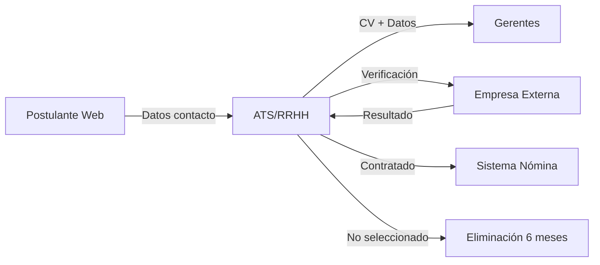

# 📊 PLAN DE IMPLEMENTACIÓN - Módulo de Inventario Práctico

## 🎯 Objetivo Principal
Transformar el módulo de inventario en un **curso práctico** que permita a los usuarios crear su propio Registro de Actividades de Tratamiento (RAT) funcional, con plantillas descargables y resultados aplicables inmediatamente.

---

## 📋 ANÁLISIS DEL ESTADO ACTUAL

### ✅ Lo que ya está implementado:
1. **Modelos completos** (`ActividadTratamiento`, `CategoriaDatos`, `BaseLegal`, etc.)
2. **Servicio con lógica de negocio** (crear actividades, categorías, evaluar riesgos)
3. **Contenido educativo** estructurado en `contenido_inventario.py`
4. **Método para generar registro** en formato JSON

### ❌ Lo que falta:
1. **Endpoints funcionales** - Solo hay un placeholder
2. **Plantillas descargables** - No hay Excel/Word templates
3. **Interfaz de entrevista guiada** - Para capturar datos paso a paso
4. **Ejemplos prácticos por industria** - Casos reales pre-poblados
5. **Visualización de flujos de datos** - Diagramas automáticos
6. **Exportación múltiples formatos** - Solo genera JSON

---

## 🛠️ IMPLEMENTACIÓN REQUERIDA

### 1. Endpoints del Módulo de Inventario

```python
# backend/app/api/v1/endpoints/inventario.py

@router.post("/actividades")
async def crear_actividad_tratamiento()
    """Crear nueva actividad con wizard guiado"""

@router.get("/actividades")
async def listar_actividades()
    """Listar todas las actividades del tenant"""

@router.get("/actividades/{id}")
async def obtener_actividad_detalle()
    """Detalle completo de una actividad"""

@router.post("/entrevista/iniciar")
async def iniciar_entrevista_guiada()
    """Inicia proceso de levantamiento guiado"""

@router.post("/entrevista/{sesion_id}/responder")
async def responder_pregunta_entrevista()
    """Procesa respuestas del wizard"""

@router.get("/plantillas/{tipo}")
async def descargar_plantilla()
    """Descarga plantillas Excel/Word"""

@router.post("/importar/excel")
async def importar_desde_excel()
    """Carga masiva desde plantilla"""

@router.get("/exportar/{formato}")
async def exportar_inventario()
    """Exporta en JSON/Excel/PDF/Word"""

@router.get("/dashboard")
async def dashboard_inventario()
    """Métricas y estado del inventario"""

@router.post("/flujos-datos/generar")
async def generar_diagrama_flujos()
    """Genera diagrama de flujos de datos"""
```

### 2. Sistema de Plantillas Descargables

#### Plantilla Excel - Registro de Actividades (RAT)
```
REGISTRO_ACTIVIDADES_TRATAMIENTO.xlsx:
- Hoja 1: Instrucciones
  - Cómo completar cada campo
  - Ejemplos por industria
  - Validaciones requeridas

- Hoja 2: Actividades
  - ID Actividad | Nombre | Descripción | Finalidad | Departamento
  - Base Legal | Categorías Datos | Plazo Conservación | etc.

- Hoja 3: Categorías de Datos
  - Listado pre-poblado según Ley 21.719
  - Niveles de sensibilidad
  - Ejemplos específicos

- Hoja 4: Flujos de Datos
  - Origen | Destino | Tipo Transfer | Finalidad | Garantías

- Hoja 5: Ejemplos por Sector
  - Salmonicultura
  - Retail
  - Salud
  - Educación
```

#### Plantilla Word - Política de Inventario
```
POLITICA_INVENTARIO_DATOS.docx:
- Portada personalizable
- Índice automático
- Secciones:
  1. Objetivo y alcance
  2. Responsabilidades (DPO, áreas)
  3. Procedimiento de levantamiento
  4. Clasificación de datos
  5. Actualización del inventario
  6. Anexos con formatos
```

### 3. Proceso de Entrevista Guiada

#### Flujo de Preguntas Inteligentes:
```python
FLUJO_ENTREVISTA = {
    "inicio": {
        "pregunta": "¿En qué departamento trabajas?",
        "opciones": ["RRHH", "Marketing", "Ventas", "TI", "Operaciones"],
        "siguiente": "procesos_departamento"
    },
    "procesos_departamento": {
        "pregunta": "¿Qué procesos realizas con datos de personas?",
        "tipo": "multiple",
        "opciones_dinamicas": True,  # Según departamento
        "siguiente": "detalle_proceso"
    },
    "detalle_proceso": {
        "pregunta": "Para el proceso {proceso}, ¿qué información recopilas?",
        "tipo": "checklist",
        "categorias_sugeridas": True,
        "siguiente": "finalidad"
    }
    # ... más preguntas
}
```

### 4. Ejemplos Prácticos Pre-configurados

#### Caso: Empresa Salmonera
```python
EJEMPLO_SALMONERA = {
    "actividades": [
        {
            "nombre": "Gestión de Personal en Centros de Cultivo",
            "finalidad": "Control de acceso, seguridad y trazabilidad",
            "datos": ["Nombre", "RUT", "Huella dactilar", "GPS ubicación"],
            "base_legal": "Obligación legal (normativa sanitaria)",
            "plazo": "5 años post término contrato"
        },
        {
            "nombre": "Monitoreo de Salud Ocupacional",
            "finalidad": "Prevención de riesgos en faenas marítimas",
            "datos": ["Exámenes médicos", "Certificados buceo", "Alergias"],
            "base_legal": "Obligación legal (Código del Trabajo)",
            "plazo": "10 años"
        }
    ]
}
```

### 5. Visualización de Flujos de Datos



### 6. Funcionalidades Adicionales

#### A. Evaluación Automática de Completitud
```python
def evaluar_completitud_inventario(tenant_id):
    return {
        "porcentaje_completo": 75,
        "actividades_sin_base_legal": 3,
        "datos_sin_clasificar": 12,
        "flujos_no_documentados": 5,
        "proxima_revision": "2024-03-15",
        "recomendaciones": [
            "Completar base legal para proceso de Marketing",
            "Clasificar datos de proveedores",
            "Documentar transferencias a cloud"
        ]
    }
```

#### B. Alertas y Recordatorios
- Datos sin política de retención
- Actividades sin revisar > 6 meses
- Nuevos sistemas no inventariados
- Cambios normativos relevantes

---

## 📱 INTERFAZ DE USUARIO (Frontend)

### Pantalla Principal del Módulo
```
┌─────────────────────────────────────────────┐
│  💼 Mi Inventario de Datos                  │
├─────────────────────────────────────────────┤
│                                             │
│  [+ Nueva Actividad]  [🔄 Importar] [📥 Exportar] │
│                                             │
│  ┌─────────────┐  ┌─────────────┐         │
│  │ Actividades │  │ Completitud │         │
│  │     23      │  │    78%      │         │
│  └─────────────┘  └─────────────┘         │
│                                             │
│  📊 Actividades por Departamento            │
│  [====RRHH====][==Marketing==][=TI=]       │
│                                             │
│  ⚠️ Requieren Atención:                    │
│  • 3 actividades sin base legal            │
│  • 5 con datos sensibles sin DPIA          │
│                                             │
│  🎯 Acciones Rápidas:                       │
│  [🎤 Entrevista Guiada]                    │
│  [📄 Descargar Plantillas]                 │
│  [📊 Ver Dashboard]                        │
└─────────────────────────────────────────────┘
```

### Wizard de Entrevista
```
┌─────────────────────────────────────────────┐
│  Paso 3 de 8: Datos que Recopilas          │
├─────────────────────────────────────────────┤
│                                             │
│  Para "Proceso de Selección", marca todos  │
│  los datos que solicitas:                  │
│                                             │
│  ☑ Nombre completo                         │
│  ☑ RUT                                     │
│  ☑ Email                                   │
│  ☑ Teléfono                               │
│  ☑ Dirección                              │
│  ☐ Estado civil                           │
│  ☑ Estudios/Títulos                       │
│  ☑ Experiencia laboral                    │
│  ☐ Datos de salud                         │
│  ☐ Afiliación sindical                    │
│  ☑ Pretensiones de renta 💡               │
│                                             │
│  💡 Dato sensible según Ley 21.719          │
│                                             │
│  [← Anterior] [Guardar Borrador] [Siguiente →] │
└─────────────────────────────────────────────┘
```

---

## 🚀 CRONOGRAMA DE IMPLEMENTACIÓN

### Semana 1: Backend Core
- [ ] Implementar todos los endpoints
- [ ] Crear lógica de entrevista guiada
- [ ] Generar plantillas Excel/Word

### Semana 2: Frontend y UX
- [ ] Desarrollar interfaz de inventario
- [ ] Implementar wizard de entrevista
- [ ] Crear visualizaciones y dashboard

### Semana 3: Contenido y Testing
- [ ] Cargar ejemplos por industria
- [ ] Validar flujos completos
- [ ] Ajustar según feedback

---

## 📈 MÉTRICAS DE ÉXITO

1. **Usuario puede completar su primer RAT en < 30 minutos**
2. **Plantillas descargadas y reutilizables**
3. **Dashboard muestra estado real del inventario**
4. **Exportación lista para auditoría**
5. **Ejemplos aplicables a su industria**

---

## 🎓 VALOR EDUCATIVO + PRÁCTICO

El módulo cumple doble propósito:
1. **Enseña** los conceptos mientras se usa
2. **Produce** documentación real y funcional

No es solo teoría, es una herramienta de trabajo real.

---

*"Aprender haciendo" - El usuario termina con su inventario listo*
