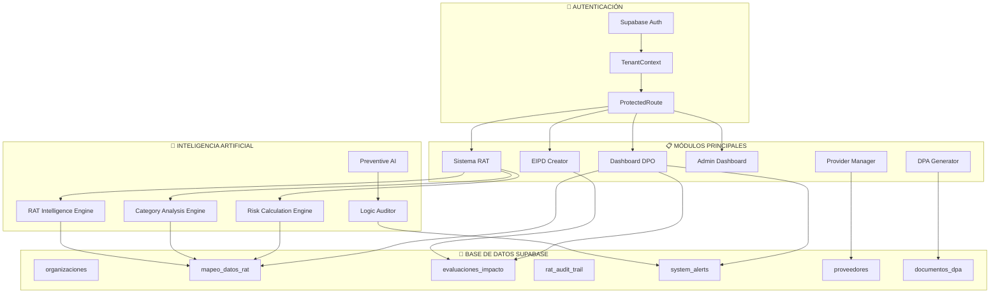

# 🏗️ DIAGRAMA DE FLUJO COMPLETO - SISTEMA LPDP
## Ley 21.719 Protección Datos Personales Chile

---

## 🌐 ARQUITECTURA GENERAL DEL SISTEMA



---

## 📋 FLUJO MÓDULO RAT (Sistema Principal)

### **ENTRADA**: Usuario crea nuevo RAT
```
🚀 INICIO CREACIÓN RAT
  ↓
[Usuario accede a /rat-system] 
  ↓
[🔐 ProtectedRoute valida permisos]
  ↓
[📊 RATSystemProfessional carga]
  ↓
[🏢 Cargar datos permanentes empresa/DPO]
  • Busca último RAT para tenant
  • Si no hay RATs → usar datos tenant básicos
  ↓
[👤 PASO 1: Responsable del Tratamiento]
  • Nombre, RUT, dirección
  • Representante legal
  • DPO designado
  ↓
[🎯 PASO 2: Finalidades del Tratamiento]
  • Finalidad principal
  • Finalidades secundarias
  • Base legal (Art. 6 Ley 21.719)
  ↓
[📊 PASO 3: Categorías de Datos] ← 🧠 IA ANÁLISIS AUTOMÁTICO
  • Datos identificativos
  • Datos sensibles → 🚨 TRIGGER EIPD
  • Datos económicos
  • Datos laborales
  • Datos comunicaciones
  • Datos técnicos
  ↓
[🏢 PASO 4: Fuentes de Obtención]
  • Titular directo
  • Terceros
  • Fuentes públicas
  ↓
[👥 PASO 5: Destinatarios]
  • Internos
  • Externos
  • Encargados → 🔄 TRIGGER DPA
  ↓
[🌍 PASO 6: Transferencias Internacionales]
  • Países destino
  • Salvaguardas
  ↓
[📅 PASO 7: Plazos y Supresión]
  • Tiempo conservación
  • Criterios supresión
  ↓
[⚖️ PASO 8: Derechos Titulares]
  • Canales ejercicio
  • Plazos respuesta
  ↓
[🔒 PASO 9: Medidas Seguridad]
  • Técnicas
  • Organizativas
  ↓
[🧮 CÁLCULO AUTOMÁTICO RIESGO] ← 🤖 RISK ENGINE
  • Puntuación multi-dimensional
  • Categorización: BAJO/MEDIO/ALTO
  ↓
[💾 GUARDAR RAT EN SUPABASE]
  • Insertar en mapeo_datos_rat
  • Generar ID único
  • 🤖 Preventive AI → auto-corrección
  ↓
[🧠 POST-PROCESAMIENTO IA]
  • 🔍 Category Analysis Engine
  • 📊 Specific Cases Engine
  • ⚠️ Logic Auditor
  ↓
[🚨 EVALUACIONES AUTOMÁTICAS]
  ¿Datos sensibles? → SÍ → [📋 CREAR EIPD OBLIGATORIA]
  ¿Encargados? → SÍ → [📄 GENERAR DPA]
  ¿Riesgo ALTO? → SÍ → [👨‍💼 NOTIFICAR DPO]
  ↓
[✅ RAT COMPLETADO]
  • Estado: COMPLETADO
  • 🔔 Notificaciones enviadas
  • 📊 Métricas actualizadas
```

### **BIFURCACIONES CRÍTICAS**:
- **Datos Sensibles** → EIPD Obligatoria (Art. 25)
- **Encargados Tratamiento** → DPA Obligatorio (Art. 24) 
- **Riesgo ALTO** → Aprobación DPO + Consulta Previa APDP

---

## 📋 FLUJO MÓDULO EIPD CREATOR

### **ENTRADA**: Desde RAT o independiente
```
🚀 INICIO EIPD
  ↓
[¿Viene desde RAT?]
  ↓ SÍ → [Pre-llenar datos desde RAT]
  ↓ NO → [Formulario vacío]
  ↓
[📝 PASO 1: Información General]
  • Nombre evaluación
  • Evaluador responsable
  • Descripción actividad
  ↓
[⚖️ PASO 2: Criterios Necesidad Art. 25]
  ✅ Datos sensibles gran escala
  ✅ Decisiones automatizadas
  ✅ Observación sistemática
  ✅ Nuevas tecnologías (IA, IoT)
  ✅ Datos menores masivo
  ✅ Combinación fuentes múltiples
  ↓
[🔍 EVALUACIÓN AUTOMÁTICA]
  ¿Cumple criterios? → SÍ → [🚨 EIPD OBLIGATORIA]
  ↓
[📊 PASO 3: Descripción Sistemática]
  • Finalidades específicas
  • Categorías datos/titulares
  • Destinatarios y transferencias
  ↓
[⚖️ PASO 4: Necesidad y Proporcionalidad]
  • Evaluación necesidad
  • Alternativas menos invasivas
  • Justificación proporcional
  ↓
[🎯 PASO 5: Matriz Evaluación Riesgos]
  Para cada factor de riesgo:
  • Probabilidad: BAJA/MEDIA/ALTA
  • Impacto: BAJO/MEDIO/ALTO
  • Cálculo automático nivel final
  ↓
[🛡️ PASO 6: Medidas Mitigación]
  • Técnicas: Cifrado, control acceso, etc.
  • Organizativas: Políticas, capacitación, etc.
  • Riesgo residual
  ↓
[📋 PASO 7: Conclusiones]
  • Evaluación final
  • Recomendaciones
  ↓
[🚨 DECISIÓN CRÍTICA]
  ¿EIPD Obligatoria + Riesgo ALTO?
  ↓ SÍ → [⚠️ CONSULTA PREVIA APDP REQUERIDA]
  ↓ NO → [✅ Puede proceder]
  ↓
[💾 GUARDAR EIPD]
  • Insertar evaluaciones_impacto
  • Actualizar RAT: tiene_eipd=true
  ↓
[🔔 NOTIFICAR DPO]
  • Nueva EIPD para revisión
  • Consulta previa si aplica
```

---

## 👨‍💼 FLUJO DASHBOARD DPO

### **ENTRADA**: DPO accede al centro de control
```
🚀 INICIO DASHBOARD DPO
  ↓
[🔐 Validar permisos DPO]
  ↓
[📊 Cargar métricas tiempo real]
  • RATs activos
  • EIPDs pendientes
  • Cumplimiento general
  • Tareas pendientes DPO
  ↓
[🔔 Centro notificaciones]
  • Alertas sistema
  • Nuevas EIPDs
  • RATs alto riesgo
  • Consultas previas APDP
  ↓
[⚡ ACCIONES DISPONIBLES]
  📋 [Crear EIPD/DPIA] → /eipd-creator
  📋 [Cola Aprobación DPO] → /dpo-approval-queue
  📊 [Métricas Compliance] → /compliance-metrics
  📋 [Ver RATs] → /rat-list
  ↓
[🔄 Auto-sync cada 60s]
  • Datos maestros actualizados
  • Notificaciones en tiempo real
```

### **COLA DE APROBACIÓN DPO**:
```
📋 COLA APROBACIÓN DPO
  ↓
[📊 Cargar pendientes]
  • RATs requieren aprobación
  • EIPDs nuevas
  • Consultas previas
  ↓
[👨‍💼 ACCIONES DPO]
  ✅ [Aprobar] → Cambiar estado
  ❌ [Rechazar] → Agregar comentarios
  👁️ [Ver detalles] → Navegación
  ↓
[💾 Registrar decisión]
  • Audit trail
  • Notificar usuario
  • Actualizar métricas
```

---

## 🏢 FLUJO PROVIDER MANAGER + DPA GENERATOR

### **ENTRADA**: Gestión proveedores y DPAs
```
🚀 PROVIDER MANAGER
  ↓
[📋 Listar proveedores]
  • Cargar desde tabla proveedores
  • Estado: ACTIVO/INACTIVO
  • DPA vigente: SÍ/NO
  ↓
[➕ Agregar proveedor]
  • Datos básicos
  • Tipo servicio
  • Nivel riesgo
  ↓
[📄 ¿Requiere DPA?] (Si es encargado tratamiento)
  ↓ SÍ → [🚀 INICIAR DPA GENERATOR]
  
DPA GENERATOR:
  ↓
[📋 PASO 1: Info Contrato]
  • Seleccionar proveedor
  • Duración acuerdo
  • Responsable firma
  ↓
[🏢 PASO 2: Datos Responsable]
  • Auto-llenado desde organizaciones
  • Representante legal
  ↓
[🏢 PASO 3: Datos Encargado]
  • Auto-llenado desde proveedor
  • Certificaciones
  ↓
[📊 PASO 4: Descripción Tratamiento]
  • Finalidades
  • Categorías datos
  • Operaciones tratamiento
  ↓
[🔒 PASO 5: Medidas Seguridad]
  • Controles técnicos
  • Medidas organizativas
  ↓
[🌍 PASO 6: Transferencias y Derechos]
  • Países destino si aplica
  • Procedimientos ejercicio derechos
  ↓
[📄 GENERAR DPA COMPLETO]
  • Plantilla legal automática
  • Guardar documentos_dpa
  • Preview y descarga
```

---

## 🤖 SISTEMA INTELIGENCIA ARTIFICIAL

### **FLUJO IA PREVENTIVA**:
```
🤖 PREVENTIVE AI (Monitoring Continuo)
  ↓
[🔍 Monitoreo cada 30s]
  • Interceptar acciones: CREATE_RAT, UPDATE_RAT
  • Validar estructura datos
  • Detectar inconsistencias
  ↓
[🔧 Auto-corrección inmediata]
  • ID undefined → Generar ID único
  • Referencias rotas → Reparar
  • Datos faltantes → Completar
  ↓
[⚠️ Problemas detectados]
  MISSING_DPO_APPROVAL → Crear tarea DPO
  INCONSISTENT_RISK_LEVEL → Recalcular riesgo
  MISSING_EIPD → Trigger creación EIPD
  ↓
[📊 LOGIC AUDITOR (cada 30 min)]
  • RAT riesgo ALTO → DEBE existir EIPD
  • EIPD existe → DEBE tener aprobación DPO
  • RAT creado → DEBE estar en inventario
  • Tareas DPO → DEBEN aparecer en módulos
  ↓
[💾 Reportes auditoría]
  • Guardar inconsistencias
  • Métricas compliance
  • Alertas automáticas
```

---

## 💾 ESTRUCTURA BASE DE DATOS

### **TABLAS PRINCIPALES**:
```sql
-- ORGANIZACIONES (Multi-tenant)
CREATE TABLE organizaciones (
    id SERIAL PRIMARY KEY,
    company_name VARCHAR(255),
    user_id UUID REFERENCES auth.users,
    metadata JSONB,
    active BOOLEAN DEFAULT true
);

-- RAT PRINCIPAL
CREATE TABLE mapeo_datos_rat (
    id SERIAL PRIMARY KEY,
    tenant_id INTEGER REFERENCES organizaciones(id),
    responsable JSONB,
    finalidades JSONB,
    categorias JSONB,
    nivel_riesgo VARCHAR(10),
    estado VARCHAR(50),
    created_at TIMESTAMP
);

-- EIPD
CREATE TABLE evaluaciones_impacto (
    id VARCHAR(255) PRIMARY KEY,
    rat_id VARCHAR(255),
    tenant_id INTEGER,
    tipo VARCHAR(50),
    contenido_eipd JSONB,
    requiere_consulta_previa BOOLEAN,
    status VARCHAR(50)
);

-- PROVEEDORES
CREATE TABLE proveedores (
    id SERIAL PRIMARY KEY,
    tenant_id INTEGER,
    nombre VARCHAR(255),
    tipo_servicio VARCHAR(100),
    nivel_riesgo VARCHAR(10),
    dpa_vigente BOOLEAN
);

-- DPA DOCUMENTOS
CREATE TABLE documentos_dpa (
    id SERIAL PRIMARY KEY,
    tenant_id INTEGER,
    proveedor_id INTEGER,
    contenido_dpa TEXT,
    estado VARCHAR(50)
);

-- AUDIT TRAIL
CREATE TABLE rat_audit_trail (
    id UUID PRIMARY KEY,
    rat_id VARCHAR(255),
    tenant_id INTEGER,
    action VARCHAR(100),
    old_data JSONB,
    new_data JSONB
);

-- ALERTAS SISTEMA
CREATE TABLE system_alerts (
    id UUID PRIMARY KEY,
    tenant_id VARCHAR(255),
    alert_type VARCHAR(100),
    severity VARCHAR(50),
    resolved BOOLEAN DEFAULT false
);
```

---

## 🔄 INTERCONEXIONES ENTRE MÓDULOS

### **FLUJO DE DATOS CRÍTICO**:

1. **RAT → EIPD**: 
   - Datos sensibles detectados → Auto-crear EIPD
   - Pre-llenar campos desde RAT

2. **RAT → Provider Manager**: 
   - Encargados detectados → Validar DPA vigente

3. **EIPD → DPO Dashboard**: 
   - Nueva EIPD → Notificación DPO
   - Consulta previa → Alerta crítica

4. **Provider → DPA Generator**: 
   - Selección proveedor → Pre-llenar DPA

5. **IA Engine → Todos los módulos**: 
   - Validación continua
   - Auto-corrección
   - Métricas compliance

6. **Audit Trail → Todo el sistema**: 
   - Registro completo cambios
   - Trazabilidad legal
   - Compliance reporting

---

## ⚠️ PUNTOS CRÍTICOS Y DEPENDENCIAS

### **ERRORES IDENTIFICADOS EN LOGS**:
1. **Tablas faltantes**: `inventario_rats`, `proveedores`, `rat_audit_trail`
2. **Error detectArea**: `ratIntelligenceEngine.js` contexto `this` incorrecto
3. **Error 400 organizaciones**: Query `metadata` malformada
4. **Error PATCH undefined**: ID no generado correctamente

### **FLUJO DE CORRECCIÓN**:
```
🚨 ERROR DETECTADO
  ↓
[🤖 Preventive AI intercepción]
  ↓
[🔧 Auto-corrección inmediata]
  • Generar IDs faltantes
  • Crear tablas automáticamente
  • Reparar referencias rotas
  ↓
[📊 Logic Auditor validación]
  ↓
[✅ Sistema estabilizado]
```

---

## 📊 MÉTRICAS Y REPORTES

### **KPIs PRINCIPALES**:
- **RATs totales** por tenant
- **RATs con datos sensibles** → % requieren EIPD
- **Cumplimiento EIPD** → % completadas vs requeridas
- **DPAs vigentes** → % proveedores cubiertos
- **Tiempo respuesta DPO** → Promedio aprobaciones
- **Score compliance general** → 0-100%

### **ALERTAS AUTOMÁTICAS**:
- 🚨 **RAT alto riesgo sin EIPD**
- ⚠️ **EIPD requiere consulta previa APDP**
- 📋 **DPA vencido con proveedor activo**
- 👨‍💼 **Tareas DPO pendientes > 5 días**
- 🔍 **Inconsistencias detectadas por auditor**

---

Este sistema implementa un **flujo completo de compliance** para la Ley 21.719, con **inteligencia artificial preventiva**, **auto-corrección continua** y **trazabilidad completa** de todas las operaciones.